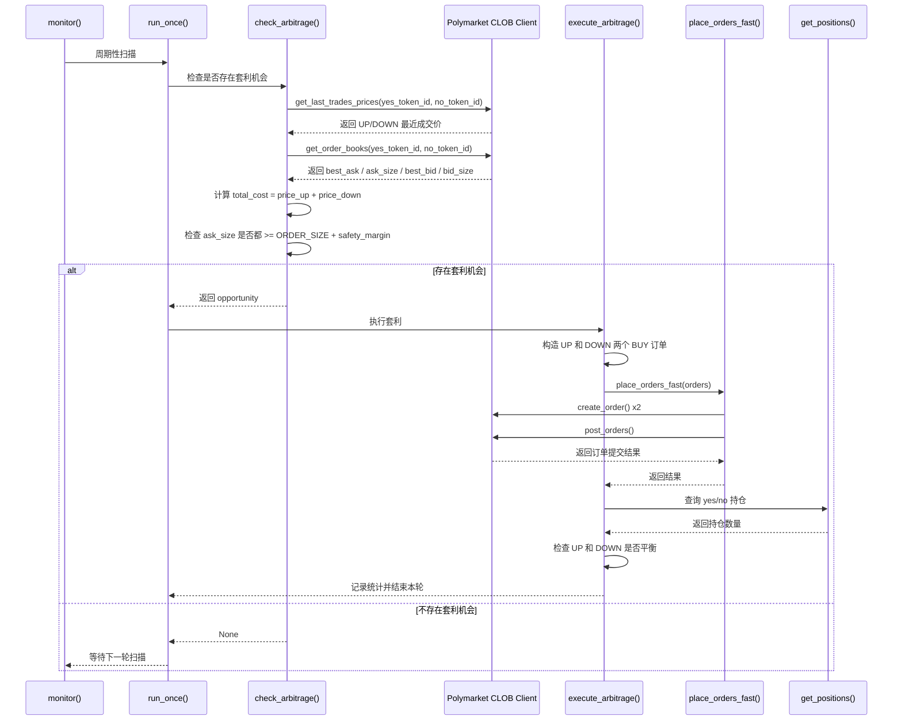

# Polymarket Arb 下单与盘口分析

## 目的

本文档整理 `polymarket-arb` 项目中与以下主题相关的核心信息，便于后续分析、回顾和继续迭代：

- 套利机会出现后，机器人如何判断是否下单
- 机器人如何使用盘口和价格数据
- 下单金额和下单数量是如何确定的
- 是否会同时买入 `UP` 和 `DOWN`
- 当前实现的主要风险点与后续分析方向

---

## 一、核心结论

### 1. 该项目是双边套利，不是单边押注

当检测到套利机会后，机器人会同时买入：

- `UP` 对应的 `YES token`
- `DOWN` 对应的 `NO token`

并且两边的下单数量相同，都是配置中的固定值 `ORDER_SIZE`。

### 2. 套利判断基于“总成本”

策略的核心判断条件是：

`UP 价格 + DOWN 价格 < TARGET_PAIR_COST`

只要两边总成本低于阈值，就认为存在套利空间。

默认配置见 `src/config.py`：

- `TARGET_PAIR_COST`：触发套利的总成本阈值，默认 `0.99`
- `ORDER_SIZE`：每边固定买入的股数，默认 `50`

### 3. 盘口只用于流动性检查，不用于精确成交测算

代码会读取订单簿中的：

- `best_ask`
- `ask_size`

但当前实现中：

- 实际套利判断价格使用的是“最近成交价” `last trade price`
- 订单簿主要用于检查卖一挂单量是否足够
- 没有基于多档盘口计算实际可成交均价
- 没有根据盘口深度自动缩放下单数量

### 4. 下单数量是固定值，不是动态计算

当前仓位大小不是按以下因素动态调整的：

- 账户余额
- 盘口深度
- 多档卖盘价格
- 当前滑点

而是直接使用 `.env` 中的固定配置 `ORDER_SIZE`，并且 `UP` 和 `DOWN` 两边相同。

### 5. 下单是批量提交，但不是原子成交

程序会先把两边订单都签好，再调用批量接口快速提交。

这意味着：

- 逻辑目标是尽量同时下单
- 但不能保证两边绝对同时、绝对等量成交
- 如果只成交一边或两边成交不一致，会出现仓位不平衡风险

---

## 二、相关代码文件

与下单和盘口相关的主要文件如下：

- `src/strategy_bot.py`
- `src/trading_client.py`
- `src/config.py`
- `src/market_lookup.py`
- `docs/GUIDE.md`

它们的职责大致如下：

- `src/strategy_bot.py`：主策略流程，负责市场发现、价格获取、套利判断和触发下单
- `src/trading_client.py`：负责交易客户端初始化、订单签名、提交订单、查询余额和持仓
- `src/config.py`：从 `.env` 读取策略参数和账户配置
- `src/market_lookup.py`：根据市场 slug 获取 market id、yes/no token id

---

## 三、下单流程总览

项目里的核心流程是：

`monitor()` -> `run_once()` -> `check_arbitrage()` -> `execute_arbitrage()` -> `place_orders_fast()`

更具体地说：

1. 启动机器人后，先自动定位当前活跃的 BTC 15 分钟市场
2. 根据市场页面解析出 `market_id`、`yes_token_id`、`no_token_id`
3. 循环扫描市场价格和订单簿
4. 判断是否出现套利机会
5. 如果满足条件，则同时准备 `UP` 和 `DOWN` 两个买单
6. 批量提交订单
7. 交易后检查两边持仓是否平衡

---

## 四、市场与 token 的映射关系

在初始化时，程序会从市场 slug 解析出：

- `yes_token_id`
- `no_token_id`

在该项目中，日志和变量命名默认把它们解释为：

- `yes_token_id` -> `UP`
- `no_token_id` -> `DOWN`

也就是说，当前策略是把：

- `UP` 视为 `YES`
- `DOWN` 视为 `NO`

这一点的来源是 `market_lookup.py` 中返回的两个 token id 顺序，以及 `strategy_bot.py` 中的日志命名方式。

注意：这个映射依赖目标市场页面的 outcomes 顺序。当前项目默认 BTC 15 分钟市场的结构符合这一预期。

---

## 五、价格与盘口数据是怎么取的

### 1. 获取价格

在 `get_current_prices()` 中，程序会调用：

- `get_last_trades_prices()`

取回两个 token 的最近成交价：

- `price_up`
- `price_down`

### 2. 获取订单簿

同一个函数里，还会调用：

- `get_order_books()`

并提取每边订单簿的：

- `best_bid`
- `best_ask`
- `spread`
- `bid_size`
- `ask_size`

当前真正被策略逻辑使用的盘口字段主要是：

- `ask_size`
- `best_ask`（虽然取到了，但没有用于最终套利判断）

### 3. 当前实现的关键事实

这里有一个非常重要的实现细节：

- 代码注释写的是“使用订单簿最佳卖价获取真实买入价格”
- 但实际判断套利时使用的却是“最近成交价”

这意味着当前实现中：

- 套利判断价格不一定等于当前真实可买到的卖一价格
- 如果最近成交价落后于当前盘口，可能会高估套利空间

---

## 六、套利机会是怎么判断的

`check_arbitrage()` 的判断逻辑可以概括为：

### 第一步：过滤异常价格

如果出现以下任意情况，就直接跳过：

- `price_up` 或 `price_down` 为空
- `price_up == 0` 或 `price_down == 0`
- `price_up >= 0.75`
- `price_down >= 0.75`

### 第二步：计算双边总成本

公式：

`total_cost = price_up + price_down`

### 第三步：与目标阈值比较

只有当：

`total_cost < TARGET_PAIR_COST`

才认定存在套利机会。

默认情况下：

- `TARGET_PAIR_COST = 0.99`

因此要求 `UP + DOWN < 0.99` 才会触发。

### 第四步：检查流动性

检测到成本满足条件后，还会检查两边卖盘数量是否足够。

逻辑如下：

- 读取 `size_up = ask_size`
- 读取 `size_down = ask_size`
- 设置固定安全边际 `safety_margin = 5`
- 计算：
  - `available_up = size_up - 5`
  - `available_down = size_down - 5`

然后要求：

- `available_up >= ORDER_SIZE`
- `available_down >= ORDER_SIZE`

只要任意一边不足，就不下单。

### 第五步：计算预期收益

一旦满足上述条件，会进一步记录：

- `profit_per_share = 1.0 - total_cost`
- `profit_pct = profit / total_cost`
- `total_investment = total_cost * ORDER_SIZE`
- `expected_payout = 1.0 * ORDER_SIZE`
- `expected_profit = expected_payout - total_investment`

这些数值主要用于日志展示和统计。

---

## 七、下单金额与数量是怎么确定的

### 1. 数量不是按盘口动态计算的

当前项目没有做这些事情：

- 沿着多档卖盘逐层计算最大可买数量
- 根据某个可接受总成本反推出最优股数
- 根据账户余额自动缩放仓位
- 根据滑点动态调整双边仓位

### 2. 数量直接来自配置

每次下单时，两边都直接使用：

- `size = self.settings.order_size`

也就是 `.env` 中的 `ORDER_SIZE`。

### 3. 总投资额的计算方式

如果：

- `UP = p1`
- `DOWN = p2`
- `ORDER_SIZE = q`

则：

- 总成本：`p1 + p2`
- 总投资额：`(p1 + p2) * q`
- 到期总兑付：`1.0 * q`

这正是二元市场双边套利的基础公式。

### 4. 两边数量始终相同

项目当前实现是：

- `UP` 买 `ORDER_SIZE`
- `DOWN` 也买 `ORDER_SIZE`

不会出现：

- `UP` 买 50 股
- `DOWN` 买 42 股

这样的动态不对称仓位配置。

---

## 八、是否是 UP 和 DOWN 一起下单

答案是：**是的。**

在 `execute_arbitrage()` 中，程序会构造两个订单：

- 一个买 `yes_token_id`
- 一个买 `no_token_id`

两者都是 `BUY`，价格分别取：

- `opportunity["price_up"]`
- `opportunity["price_down"]`

数量都取：

- `self.settings.order_size`

然后交给 `place_orders_fast()` 做批量提交。

### 当前的执行方式

`place_orders_fast()` 的策略是：

1. 先遍历订单列表
2. 为每个订单创建 `OrderArgs`
3. 使用客户端预签名
4. 将签好的订单放进 `PostOrdersArgs`
5. 最后调用 `client.post_orders()` 一次性批量提交

这比逐笔串行发送更快，但仍然存在现实中的执行风险：

- 一边成交、另一边未成交
- 两边都挂出去了，但成交速度不同
- 实际成交价与判断时价格不同

---

## 九、订单类型与执行特征

当前项目下单时使用的是：

- `OrderType.GTC`

即：

- Good-Til-Cancelled

这意味着订单会保留在订单簿中，直到成交、被取消或被系统处理。

这进一步说明当前策略并不是严格意义上的“立即吃单并且必须双边同时成交”的原子执行模型。

如果价格迅速变化，理论上可能出现：

- 一边成交
- 一边挂单未成交
- 或两边以不完全符合预期的方式成交

---

## 十、交易后的校验逻辑

提交订单后，程序会：

1. 等待约 1 秒
2. 查询两边持仓
3. 比较 `UP` 和 `DOWN` 的持仓数量是否一致

如果两边持仓差值大于 `0.1`，程序会发出警告，提示仓位不平衡，可能需要人工干预。

需要注意的是：

- 这里只做“检查和告警”
- 没有自动补单
- 没有自动撤单
- 没有自动做平衡修复

因此仓位不平衡风险是当前实现中的重要风险点。

---

## 十一、当前实现的关键风险与偏差

### 1. 套利判断价格与真实可成交价格可能不一致

这是当前最重要的问题之一。

虽然代码读取了订单簿的 `best_ask`，但实际判断套利机会使用的是最近成交价 `last trade price`。这样会导致：

- 日志上看起来有套利
- 但真实卖一价格并不支持该套利空间

### 2. 只检查卖一数量，不检查多档深度

当前只验证：

- 两边卖一是否都有足够数量

没有计算：

- 如果目标买入量超过卖一后，下一档价格会不会把总成本推高到无利可图

### 3. 下单数量固定，缺乏自适应

如果盘口挂单很薄，固定 `ORDER_SIZE` 可能：

- 经常因为深度不足而错过机会
- 或在边界情况下放大执行风险

### 4. 批量提交不是原子成交

即使调用了批量接口，也不能完全消除：

- 单边成交风险
- 异步成交风险
- 价格变化风险

### 5. 余额没有形成明确的下单前硬约束

代码中虽然可以查询余额，但当前主要看到的是：

- 交易后更新余额缓存

没有看到一个清晰、严格的“下单前按本次投资额校验账户可用余额并拒绝下单”的显式策略控制。

---

## 十二、关键配置项整理

与本主题最相关的配置项如下：

- `TARGET_PAIR_COST`
  - 双边总成本阈值
  - 只有 `UP + DOWN < TARGET_PAIR_COST` 才触发套利

- `ORDER_SIZE`
  - 每边买入的固定股数
  - 当前不做动态调整

- `DRY_RUN`
  - 是否只模拟不真实下单

- `MAX_TRADES_PER_MARKET`
  - 每个 15 分钟市场最多允许执行多少次套利

- `MIN_TIME_REMAINING_MINUTES`
  - 如果距离市场结束太近，则跳过交易

---

## 十三、适合后续重点分析的问题

为了更严谨地评估该策略，后续建议重点分析以下问题：

### 1. 判断价格是否应该改为真实卖一或多档加权价格

当前用最近成交价判断套利，容易偏乐观。

更合理的方向可能是：

- 直接用 `best_ask` 作为即时可买价格
- 或进一步读取多档卖盘，计算在目标买量下的真实平均买入成本

### 2. 是否要根据盘口深度动态决定下单数量

当前固定使用 `ORDER_SIZE`，比较简单，但不够精细。

可以考虑：

- 基于两边最薄的一侧深度来决定本次最大可下股数
- 基于目标利润阈值和滑点约束反推下单量

### 3. 是否需要自动处理单边成交风险

当前只有告警，没有自动补救。

后续可以考虑：

- 自动检测未成交侧
- 自动补单
- 超时撤单
- 仓位对冲或紧急平衡逻辑

### 4. 是否需要增加下单前余额约束

当前建议明确增加：

- 下单前资金检查
- 预估投资额与账户可用余额的比较
- 安全冗余资金保护

---

## 十四、我后续可以继续帮你做的两件事

下面这两件事已经明确列为后续工作项，便于你之后继续分析和回顾：

### 任务 1：画出“发现机会到双边下单”的时序图

目标：

- 把该项目从扫描市场、判断套利、构造订单、提交订单、校验持仓的全过程整理成一张时序图

价值：

- 方便快速理解整体流程
- 方便排查在哪一步引入执行风险
- 适合后续和真实交易记录做比对

### 任务 2：指出“如果要改成按真实卖一/多档盘口计算可成交数量”，应该改哪几处代码

目标：

- 明确应该修改哪些函数、哪些变量、哪些判断逻辑

重点位置预计包括：

- `src/strategy_bot.py` 中的 `get_current_prices()`
- `src/strategy_bot.py` 中的 `check_arbitrage()`
- `src/strategy_bot.py` 中的 `execute_arbitrage()`
- 可能扩展 `src/trading_client.py` 的盘口读取与订单执行支持

价值：

- 便于把当前策略从“粗粒度判断”升级为“更接近真实成交条件的判断”
- 降低因为使用最近成交价而误判套利空间的风险

---

## 十五、“发现机会到双边下单”的时序图

下面这张图把当前项目从扫描到下单再到校验持仓的核心链路串起来了。



### 时序图解读

从时序图可以看出，当前项目的关键特点是：

1. 扫描和判断发生在 `check_arbitrage()`
2. 下单动作发生在 `execute_arbitrage()`
3. 交易接口层在 `place_orders_fast()`
4. 价格判断和盘口检查虽然都发生了，但使用方式并不一致

更准确地说：

- 价格判断使用的是最近成交价
- 流动性检查使用的是订单簿卖一数量
- 实际下单时沿用的是判断时记录的 `price_up` 和 `price_down`

因此，“看到有套利”并不等于“当前盘口上按这个价格一定能成交”。

### 当前每一步实际读取的数据

为了方便后续回顾，可以把每一步读到的关键字段明确列出来：

#### 1. 市场发现阶段

来源：

- `find_current_btc_15min_market()`
- `fetch_market_from_slug()`

拿到的数据：

- `market_slug`
- `market_id`
- `yes_token_id`
- `no_token_id`
- `start_date`
- `end_date`

#### 2. 价格阶段

来源：

- `self.client.get_last_trades_prices(params=params)`

拿到的数据：

- `price_up`
- `price_down`

用途：

- 计算 `total_cost`
- 计算理论利润
- 作为后续下单价格

#### 3. 盘口阶段

来源：

- `self.client.get_order_books(params=params)`

拿到的数据：

- `best_bid`
- `best_ask`
- `spread`
- `bid_size`
- `ask_size`

当前真正用到的数据：

- `ask_size`
- `best_ask` 只被读取，没有进入最终套利公式

#### 4. 机会判断阶段

关键输入：

- `price_up`
- `price_down`
- `size_up`
- `size_down`
- `TARGET_PAIR_COST`
- `ORDER_SIZE`

关键输出：

- `opportunity` 字典

该字典内主要包含：

- `price_up`
- `price_down`
- `total_cost`
- `profit_per_share`
- `profit_pct`
- `order_size`
- `total_investment`
- `expected_payout`
- `expected_profit`

#### 5. 执行阶段

构造两个订单：

- `BUY yes_token_id @ price_up size=ORDER_SIZE`
- `BUY no_token_id @ price_down size=ORDER_SIZE`

执行方式：

- 预签名两笔订单
- 调用 `post_orders()` 批量提交

#### 6. 事后校验阶段

来源：

- `get_positions()`

拿到的数据：

- 当前 `yes_token_id` 持仓
- 当前 `no_token_id` 持仓

用途：

- 比较两边持仓是否平衡
- 如果差异大于 `0.1`，发出警告

---

## 十六、如果改成按真实卖一或多档盘口计算，需要改哪些代码

这一部分的目标，是把当前策略从“最近成交价 + 卖一数量检查”的模型，升级成更接近真实成交条件的模型。

可以分为两个版本来理解：

- 版本 A：先改成按真实卖一判断
- 版本 B：进一步改成按多档盘口计算可成交数量和均价

### 方案 A：改成按真实卖一判断

这是最小改造版本，优先级最高。

#### 需要改的代码点 1：`get_current_prices()`

当前行为：

- 调 `get_last_trades_prices()` 拿最近成交价
- 调 `get_order_books()` 拿卖一和深度

建议修改为：

- 仍然保留 `get_order_books()`
- 但将用于套利判断的价格从 `last trade price` 改成 `best_ask`

建议改动后的逻辑方向：

- `effective_up_price = best_up`
- `effective_down_price = best_down`

然后把它们作为真正返回值的一部分。

建议返回的数据从：

- `price_up, price_down, size_up, size_down, best_up, best_down`

调整为更明确的结构，例如：

- `last_price_up`
- `last_price_down`
- `best_ask_up`
- `best_ask_down`
- `ask_size_up`
- `ask_size_down`

或者直接返回字典，避免元组位置出错。

#### 需要改的代码点 2：`check_arbitrage()`

当前行为：

- `total_cost = price_up + price_down`

建议修改为：

- `total_cost = best_ask_up + best_ask_down`

同时：

- 流动性检查继续基于 `ask_size`
- 日志里同时打印最近成交价和真实卖一价
- `opportunity` 中增加明确字段，例如：
  - `execution_price_up`
  - `execution_price_down`
  - `reference_last_price_up`
  - `reference_last_price_down`

这样后面排查时可以区分：

- “市场刚才成交在什么价”
- “此刻我真正能买到什么价”

#### 需要改的代码点 3：`execute_arbitrage()`

当前行为：

- 使用 `opportunity["price_up"]`
- 使用 `opportunity["price_down"]`

建议修改为：

- 使用 `opportunity["execution_price_up"]`
- 使用 `opportunity["execution_price_down"]`

这样才能保证：

- 判断套利时使用的价格
- 实际送单时使用的价格

是同一组数据。

#### 方案 A 的收益

完成这一层后，策略会立刻更真实一些，因为它不再依赖“过去刚成交过的价格”，而是依赖“现在真正挂在卖一上的价格”。

但它仍然有局限：

- 只看卖一
- 如果 `ORDER_SIZE` 会吃穿卖一，则成本仍然会被低估

---

### 方案 B：改成按多档盘口计算可成交数量和均价

这是更贴近真实执行的升级方案。

核心思想是：

- 不再只看卖一
- 而是沿着 `asks` 逐档累加
- 计算在目标买量下的真实平均买价
- 或反过来，在目标利润约束下求最大可买量

#### 需要改的代码点 1：扩展 `_fetch_orderbooks()`

当前行为：

- 只提取第一档 `best_bid / best_ask / bid_size / ask_size`

建议修改为：

- 保留完整 `asks` 列表
- 保留完整 `bids` 列表

建议返回结构增加：

- `asks: [{"price": x, "size": y}, ...]`
- `bids: [{"price": x, "size": y}, ...]`

这样后续策略层才能真正按多档盘口计算。

#### 需要改的代码点 2：在 `strategy_bot.py` 新增盘口成交测算函数

建议新增辅助函数，例如：

```python
def estimate_buy_cost_from_asks(asks, target_size):
    """
    沿卖盘逐档吃单，返回：
    - filled_size
    - total_cost
    - avg_price
    - worst_price
    """
```

这个函数负责：

1. 从最优卖盘开始遍历
2. 逐档累加可成交数量
3. 直到达到 `target_size` 或卖盘耗尽
4. 计算真实总成本和平均成交价

#### 需要改的代码点 3：重写 `check_arbitrage()`

当前逻辑是：

- 固定 `ORDER_SIZE`
- 检查卖一数量够不够
- 用最近成交价算总成本

建议升级后的逻辑是：

1. 对 `UP` 盘口调用 `estimate_buy_cost_from_asks(asks_up, ORDER_SIZE)`
2. 对 `DOWN` 盘口调用 `estimate_buy_cost_from_asks(asks_down, ORDER_SIZE)`
3. 如果任意一边 `filled_size < ORDER_SIZE`，直接跳过
4. 用两边的真实平均买价或真实总成本求：
   - `real_total_cost`
   - `real_profit_per_share`
5. 只有当真实总成本仍低于阈值时才触发

这样可以避免现在这种情况：

- 卖一价格看起来便宜
- 但你真正想买的数量会吃到更差的第二档、第三档
- 最终总成本已不再有套利空间

#### 需要改的代码点 4：如果要动态决定下单量，需要新增“仓位求解逻辑”

如果你希望不是固定 `ORDER_SIZE`，而是“按盘口实时决定可下多少”，则可以再新增一个函数，例如：

```python
def find_max_profitable_size(asks_up, asks_down, max_size, target_pair_cost):
    """
    在给定盘口和阈值下，寻找仍然满足套利条件的最大双边股数
    """
```

它的思路可以是：

1. 从小到大尝试买量
2. 计算该买量下 UP 和 DOWN 的真实总成本
3. 找出仍满足阈值的最大值

更高效的做法也可以是：

- 直接遍历盘口档位分段计算
- 不必逐股枚举

#### 需要改的代码点 5：`execute_arbitrage()` 接收动态数量

一旦上层开始动态决定真实可下数量，执行层也必须同步修改。

当前写法是：

- 两笔订单都使用 `self.settings.order_size`

建议修改为：

- 使用 `opportunity["order_size"]`

这样：

- 当策略层决定“这次只下 17 股”时
- 执行层才能按 17 股下单，而不是仍然强制按固定配置下单

#### 需要改的代码点 6：余额与风控检查

如果要认真按盘口动态下单，建议顺手补上资金约束。

建议在 `check_arbitrage()` 或 `execute_arbitrage()` 之前增加：

- 读取账户可用余额
- 比较 `estimated_total_cost` 与余额
- 预留 buffer，例如 `balance_slack`

建议逻辑示意：

```python
required_cash = estimated_total_cost * order_size
if required_cash > available_balance - balance_slack:
    skip
```

这样可以避免：

- 账面上看有机会
- 但实际资金不够双边完整执行

---

### 推荐的改造顺序

为了降低改动风险，建议按下面顺序逐步升级：

1. 先把套利判断价格从 `last trade price` 改成 `best_ask`
2. 再把 `execute_arbitrage()` 改成使用明确的 `execution_price_*`
3. 然后扩展 `_fetch_orderbooks()`，保留完整 `asks`
4. 新增多档盘口成本测算函数
5. 再把 `check_arbitrage()` 改成基于真实吃单成本判断
6. 最后再决定是否启用动态仓位、余额约束和自动修复逻辑

这个顺序的好处是：

- 每一步都可单独验证
- 不会一次性把策略、执行、风控全改乱
- 出问题时更容易定位是哪一层引入了偏差

---

### 改造后的理想数据流

如果后续你要把策略升级得更严谨，理想上的数据流应该变成：

1. 获取完整 `asks`
2. 根据目标买量计算：
   - 两边真实可成交数量
   - 两边真实总成本
   - 两边真实平均成交价
   - 最差成交价
3. 检查真实总成本是否仍然满足套利阈值
4. 检查余额是否足够
5. 将“测算出的真实执行价格和数量”写入 `opportunity`
6. 执行层严格按 `opportunity` 提交订单
7. 交易后检查双边持仓和平衡状态

这会比当前模型更接近真实市场执行环境。

---

## 十七、最终摘要

当前 `polymarket-arb` 的下单逻辑本质上是一个二元市场双边套利模型：

- 通过检查 `UP + DOWN` 的总成本是否低于阈值来识别套利机会
- 通过检查订单簿卖一数量确认基础流动性
- 以固定股数 `ORDER_SIZE` 同时买入 `UP` 和 `DOWN`
- 通过批量提交订单来尽量缩短双边下单间隔

但从实现精度上看，当前仍然属于偏简化版本，主要问题包括：

- 套利判断使用最近成交价，而不是真实卖一价格
- 只检查卖一深度，没有计算多档成交成本
- 下单数量固定，不会自适应盘口
- 对单边成交风险只做告警，没有自动修复

如果后续要把它升级成更适合真实交易环境的版本，重点应放在：

- 用真实盘口价格替代最近成交价
- 根据盘口深度动态计算可成交数量
- 增强双边执行一致性和风险控制

---

## 十八、常见下单场景结论

这一节整理了当前实现下，几个最关键的双边下单场景结论，并明确哪些行为符合预期，哪些行为后续必须改进。

### 场景 1：双边各下 5 份，但账户资金只够单边 5 份

当前实现结论：

- 代码不会在下单前做严格的“本次双边总资金需求”校验
- 程序仍会尝试同时提交两边订单
- 是否被拒单，取决于交易接口返回结果
- 如果发生部分成功、部分失败，当前实现缺乏自动修复逻辑

结论判断：

- **这不符合预期**
- **这是当前代码实现中的一个问题**

原因：

- 双边套利策略的前提是两边都能完整建立仓位
- 如果账户资金只够单边，却仍然允许发起双边单，会引入明显的单边暴露风险

### 场景 2：双边下单时，一边下单成功，另一边未成交

当前实现结论：

- 程序会在交易后查询持仓
- 如果两边持仓不平衡，只会打印警告
- 不会自动补单
- 不会自动撤单
- 不会自动对冲
- 不会自动执行仓位修复

结论判断：

- **这不符合预期**
- **这是当前代码实现中的一个问题**

原因：

- 双边套利的核心要求是仓位配对
- 一边成功、一边未成交时，账户已经暴露在单边方向风险里
- 仅仅告警，不足以满足实盘风控要求

### 场景 3：双边下单 5 份，但卖一数量不够 5 份

当前实现结论：

- 代码会在下单前直接跳过该机会
- 并且判断还比较保守，因为它会先减去固定 `5` 份安全边际

结论判断：

- **这个行为符合预期**

原因：

- 当卖一深度不足以承接目标下单量时，直接放弃机会是合理的
- 至少比“强行下单导致滑点或单边成交风险”更安全

不过需要注意：

- 当前实现只检查卖一，不检查多档卖盘
- 所以它只是“基础符合预期”，还不是“最终理想实现”

---

## 十九、明确需要改进的功能

基于上述三个场景，目前最明确需要改进的是前两个问题。

### 改进项 1：增加下单前资金充足性检查

当前状态：

- `已实现第一版（2026-03-26）`
- 机器人启动时会初始化余额缓存
- 监控循环中会按固定间隔刷新余额缓存
- 发现套利机会后，只读取内存中的余额缓存做快速判断
- 不再在机会触发后额外发起余额查询，避免拖慢下单速度

目标：

- 在正式提交双边订单之前，就已经准备好最新余额状态
- 发现套利机会后不再额外发起余额查询，避免拖慢下单速度

建议实现要点：

- 在后台按固定间隔刷新账户可用余额
- 将余额结果写入内存缓存，例如 `cached_balance`
- 记录最近一次余额更新时间
- 当发现套利机会时，只读取缓存余额进行快速判断
- 计算本次双边理论总成本
- 计算本次所需总资金
- 预留安全冗余，例如 `balance_slack`
- 若缓存余额不足，则直接跳过本次机会，不发送任何订单
- 若余额缓存过期，则优先刷新缓存，而不是在下单热路径中阻塞等待

建议的判断逻辑：

- `required_cash = execution_total_cost * order_size`
- `available_cash = cached_balance - balance_slack`
- 如果 `required_cash > available_cash`，则拒绝下单

建议新增能力：

- 在日志里明确输出：
  - 最近一次余额更新时间
  - 本次所需资金
  - 当前缓存可用余额
  - 因余额不足而跳过

该功能的价值：

- 避免“明知双边建仓资金不够，却仍然发单”
- 降低部分成交和异常失败风险
- 让策略更符合双边套利的基本前提
- 同时避免在发现机会后再查余额，从而影响抢单速度

### 改进项 2：增加单边成交后的自动修复机制

当前状态：

- `已实现第一版（2026-03-26）`
- 当前版本的修复流程是：
  1. 下单后检查双边持仓
  2. 如果不平衡，先查询并撤销本次相关订单里仍处于 `live/delayed/unmatched` 的挂单
  3. 对仓位较少的一侧发起一次 `FOK` 补单
  4. 修复后再次检查持仓
  5. 如果仍不平衡，则本次套利不记为成功，并提示人工处理
- 这一版的定位是“基础保护”，目标是先把明显的单边暴露风险降下来
- 仍未完全实现：
  - 多轮补单 / 多轮撤单
  - 超时等待后的重试策略
  - 无法补齐时的自动平仓或对冲
  - 更细粒度的订单部分成交分析

目标：

- 当双边下单后出现仓位不平衡时，不是只报警，而是进入自动处理流程

建议至少覆盖以下情况：

- 一边成功，另一边提交失败
- 两边都已提交，但只有一边成交
- 两边都部分成交，但数量不一致

建议实现方向：

#### 方向 A：自动补单

逻辑：

- 检查 `UP` 和 `DOWN` 的实际持仓差
- 对少的一边自动补下差额

适用场景：

- 流动性仍然存在
- 差额较小
- 补单成本仍在可接受范围内

#### 方向 B：超时撤单

逻辑：

- 如果某一边订单长时间未成交
- 或只成交部分数量
- 则自动撤掉剩余挂单，避免风险继续扩大

适用场景：

- 市场价格快速变化
- 继续等待已经不合理

#### 方向 C：紧急平仓或对冲

逻辑：

- 如果无法补齐另一边
- 则考虑把已经成交的一边卖出或对冲，尽快消除方向暴露

适用场景：

- 市场深度不足
- 价差恶化
- 风控优先于继续套利

建议新增能力：

- 保存每笔订单的 order id
- 能查询订单状态
- 能取消未成交订单
- 能识别部分成交数量
- 能按“目标平衡数量”自动决定补单或回退

该功能的价值：

- 降低单边暴露风险
- 提高策略从“研究版”走向“实盘版”的可用性
- 让异常场景处理更可控

### 改进项 3：把“持仓检查”升级为“风控状态机”

当前实现：

- 只在下单后睡 1 秒
- 再查一次持仓
- 如果不平衡就打印 warning

后续建议升级为更完整的状态机：

1. 订单已提交
2. 等待成交确认
3. 检查双边成交数量
4. 如果平衡，标记成功
5. 如果不平衡，进入修复流程
6. 修复失败，进入紧急处理流程
7. 输出最终处理结果

该功能的价值：

- 能把“下单成功”与“套利真正完成”区分开
- 防止程序把有风险的异常场景误记为成功交易

### 改进项 4：补充订单状态查询与取消能力

当前状态：

- `已实现第一版（2026-03-26）`
- 已新增底层能力：
  - 查询单笔订单状态
  - 查询 open orders
  - 单笔撤单
  - 批量撤单
- 已新增基础保护：
  - 当批量下单结果中出现错误且已有部分订单拿到 `orderID` 时，会立即尝试撤单
- 仍未完全实现：
  - 对“已提交但未成交”的超时撤单策略
  - 对“部分成交”的自动修复策略
  - 与双边仓位自动平衡逻辑的完整联动

为了支持上述自动修复逻辑，后续基本还需要补齐以下底层能力：

- 查询单笔订单状态
- 查询是否完全成交、部分成交、未成交
- 取消未成交订单
- 获取剩余未成交数量

如果缺少这些能力，上层就很难做自动修复。

---

## 二十、建议的后续实现优先级

为了控制改动风险，建议按下面顺序推进：

### 第一优先级

- 增加下单前余额校验
- 如果双边总资金不足，直接跳过，不发送任何订单

原因：

- 这项改造风险最小
- 但能立刻解决“资金只够单边却仍发双边单”的明显问题

### 第二优先级

- 为订单执行结果保存 order id
- 补充订单状态查询能力
- 区分提交成功、部分成交、完全成交

原因：

- 这是后续自动修复的前置条件

### 第三优先级

- 增加不平衡仓位的自动补单或撤单逻辑

原因：

- 这是解决“一边成功、一边未成交”问题的核心
- 但实现复杂度和测试要求都更高

### 第四优先级

- 结合真实卖一或多档盘口，优化执行价格与补单逻辑

原因：

- 这一步可以进一步提升策略真实性
- 但建立在前面基础风控已经补齐的前提下更稳妥

